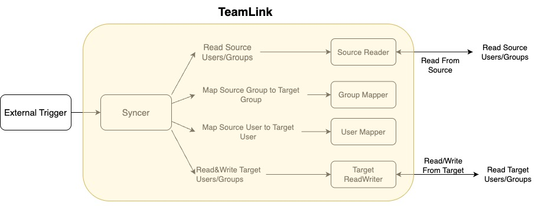

# TEAM-Link

**This is not an official Google product.**

## Overview

Team-link is a tool for syncing your org membership between different systems.

Currently the supported source systems is:

- [Google Groups](https://groups.google.com/)

The supported target system is:

- GitHub.

## Architecture

The chart below shows the architecture and workflow for TeamLink.



1. User defines two config files before triggering the syncer.
2. An external trigger triggers syncer to start the membership syncing.
3. Syncer loads the config files and initialize the readers and mappers.
4. Readers read from source and target system regarding the group and user info.
5. Syncer uses source system's membership as source of truth and sync target system's membership info.

## How to use

### Install

Team-link is implemented using go, and can be used as a cli tool. Run the following command
to install team-link.

```bash
go install github.com/abcxyz/team-link/cmd/tlctl
```

### Prepare Config

Before running CLI, two config files are required.

#### Mapping Config File

This file contains the group info and user info needed for syncing.

##### Group mapping config

This configs which group in source system is mapped to which group in the target system.

```textproto
group_mappings {
  mappings: [
      {
        google_groups: {
          group_id: "groups/foo"
        }
        github: {
          org_id: <abc>
          team_id: <xyz>
        }
      }
    ]
}
```

##### User mapping config

This configs how user in source system is mapped to the target systm.

```textproto
user_mappings {
  mappings: [
      {
        source: "foo@example.com"
        target: "foo"
      },
      {
        source: "bar@example.com"
        target: "foo"
      }
  ]
}
```

For detailed the support config format, please refer to [TeamLinkMappings](https://github.com/abcxyz/team-link/blob/main/proto/mapping.proto#L46).

#### Team-Link Config

This is where your define the config for source and target system, including how to authenticate, customized enterprise url etc.

For detailed format of teamlink config, please refer to [TeamLinkConfig](https://github.com/abcxyz/team-link/blob/main/proto/config.proto#L65)

Example:

```textproto
source_config {
    google_groups_config {}
}
target_config {
    github_config {
        enterprise_url: "https://github.com",
        static_auth {
            from_environment: "TEAM_LINK_GITHUB_TOKEN"
        }
    }
}
```

### Run CLI

run the following command to sync membership between your source and target system:

```bash
tlctl sync run \
  -m mappings.textproto \
  -c teamlink_config.textproto
```

### Use as Github Workflow

We support syncing membership from google groups to github using a workflow. The example you can follow is [here](https://github.com/abcxyz/team-link/blob/main/.github/workflows/sync.yml)
